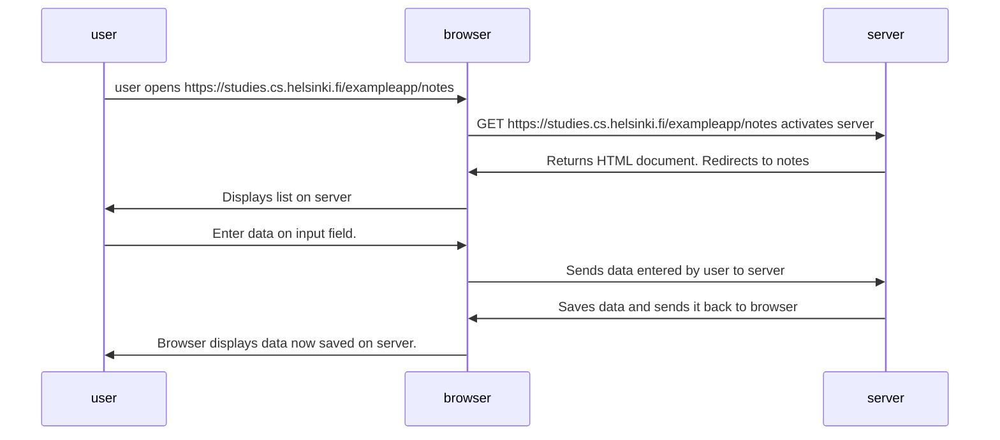

```mermaid

sequenceDiagram
    participant user
    participant browser
    participant server

    user->>browser: user opens https://studies.cs.helsinki.fi/exampleapp/notes
    browser->>server: GET https://studies.cs.helsinki.fi/exampleapp/notes activates server
    server->>browser: Returns HTML document. Redirects to notes
    browser->>user: Displays list on server
    user->>browser: Enter data on input field. 
    browser->>server: Sends data entered by user to server
    server->>browser: Saves data and sends it back to browser
    browser->>user: Browser displays data now saved on server. 
    
```